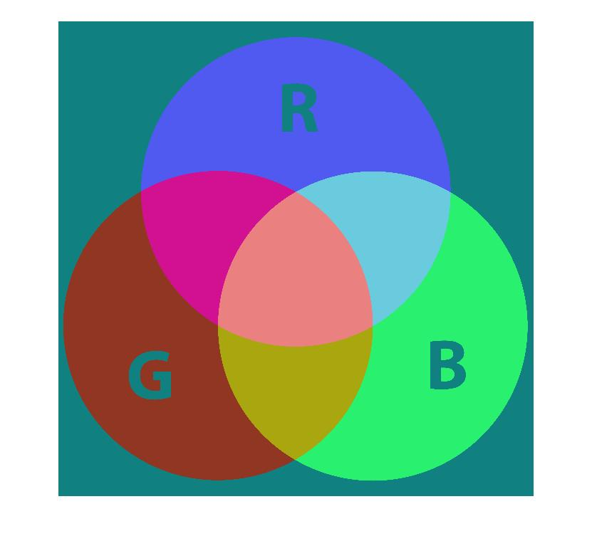
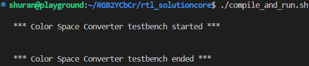
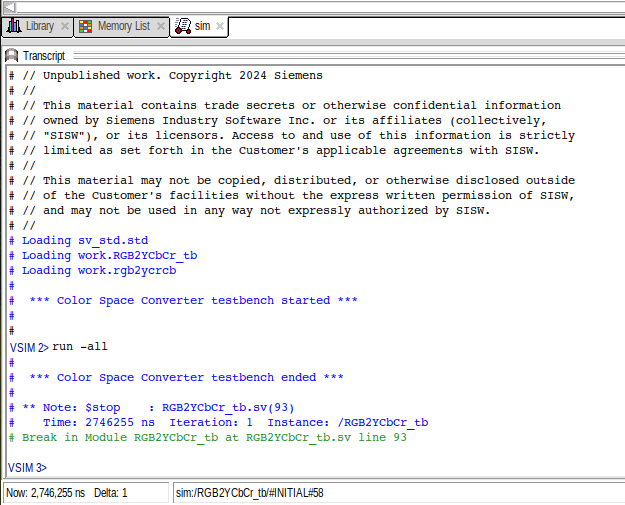
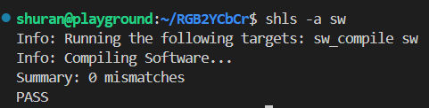
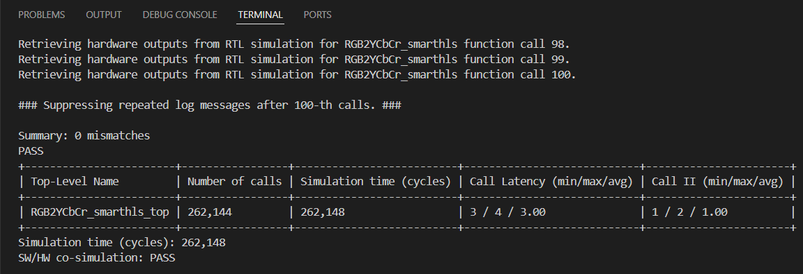

# RGB2YCbCr Project

In this project, we try prototyping a simple FPGA module that converts from a (R,G,B) pixel value to a (Y, Cb, Cr) pixel using SmartHLS C++ and RTL language `verilog`.
The idea behind this is to evaluate the pros and cons using RTL approach and C++ approach. This project is used as an example in my HLS-series blogs:</br> https://embeddedville.hashnode.dev/fpga-prototyping-in-hls-c-part-3.

## Introduction

</br>


Nowdays it is super common in video and image processing domain where RGB is converted to YCbCr.RGB is great for displaying images on screens, but not so great for
processing, compressing, or transmitting images efficiently. YCbCr separates the image into brightness (Y) and color (Cb/Cr) — and this opens up a bunch of advantages:</br>

- Better Compression Ratios: This allows separate handling of brightness and color, improving compression effectiveness.
- Color Manipulation and Enhancement: Useful for tasks like tone mapping, color grading, or filtering.
- Standardization: YCbCr is a standard color space in broadcast (e.g. TV, Blu-ray), digital cameras, and many file formats.</br></br>


The conversion from RGB to YCbCr is straightforward since all we need to do basically is to implement the following equations:
```
Assuming R, G, B ∈ [0, 255], and Y, Cb, Cr ∈ [0, 255]:
Y  =  0.299    * R + 0.587    * G + 0.114    * B
Cb = -0.168736 * R - 0.331264 * G + 0.5      * B + 128
Cr =  0.5      * R - 0.418688 * G - 0.081312 * B + 128
```

We build a circuit for the above 3 equations in both ways in this project.

## Hardware Implementation

This section consists of both module RTL implementation and the associated SystemVerilog testbench.

### Module Design

We define a module called `rgb2ycrcb` with the following declaration:
```
module rgb2ycrcb(clk, rst, r, g, b, y, cr, cb);
	input        clk;
	input        rst;
	input  [9:0] r, g, b;

	output reg [9:0] y, cr, cb;
//...
endmodule
```

One *key* difference between HLS C++ prototyping and RTL prototyping is that designing a RTL module requires the designer to have a
understanding of resource usage and timing constraint, which is typical for FPGA engineers, but rare for software engineers.

To design the circuit efficiently, we need to apply a few *FPGA-specific* optimization techniques:

- Technique 1: **Equation quantization**

Since it is super expensive to perform floating point computation, we need to quantize floating point to hexidecimal. The typical way is to first
scale up and then scale down.

- Technique 2: **Pipelining**

Since calculating `Y`, `Cb` and `Cr` in one cycles very likely fails the timing check, we use pipelining to implement those 3 equations in 3 clock cycles.
To be a little be specifc, we divide the aforementioned equations into 3 equations:

| Variables at cycle #1  | Equation | 
| ------------- | ------------- |
| yr | 10'h132 * r |
| yg | 10'h259 * g |
| yb | 10'h074 * b |
| crr | r << 9 |
| crg | 10'h1ad * g |
| crb | 10'h053 * b |
| cbr | 10'h0ad * r |
| cbg | 10'h153 * g |
| cbb | b << 9 |


| Variables at cycle #2  | Equation | 
| ------------- | ------------- |
| y1 | yr + yg + yb |
| cr1 | crr - crg - crb |
| cb1 | cbb - cbr - cbg |


| Variables at cycle #3  | Equation | 
| ------------- | ------------- |
| y | check boundaries with y1 |
| cr | check boundaries with cr1 |
| cb | check boundaries with cb1 |


</br>The above tables and the associated relations are implemented as a multiple of `always@(posedge clk)` blocks.

### Testbench Design

To evaluate the module, we need to implement a cycle-accurate SystemVerilog testbench. To maximize the chance to
thoroughly test the module, we design a test vector to be a combination of the following:

- 64 incremental values of R
- 64 incremental values of G
- 64 incremental values of B

The test vector can be iterated via nested `for` loops:
```
for (r_idx = 0; r_idx <= r_length; r_idx = r_idx + 1) begin
    for (g_idx = 0; g_idx <= g_length; g_idx = g_idx + 1) begin
        for (b_idx = 0; b_idx <= b_length; b_idx = b_idx + 1) begin
            @(posedge clk);
            r[0] <= r_idx;
            g[0] <= g_idx;
            b[0] <= b_idx;
        end
    end
end
```

To evaluate the module output we also need to implement a golden module inside the testbench:
```
always@(r[3] or g[3] or b[3])
	begin
		my  = (299 * r[3]) + (587 * g[3]) + (114 * b[3]);
		if (my < 0)
			my = 0;

		my = my /1000;
		if (my > 1024)
			my = 1024;

		mcr = (500 * r[3]) - (419 * g[3]) - ( 81 * b[3]);
		if (mcr < 0)
			mcr = 0;

		mcr = mcr /1000;
		if (mcr > 1024)
			mcr = 1024;

		mcb = (500 * b[3]) - (169 * r[3]) - (332 * g[3]);
		if (mcb < 0)
			mcb = 0;

		mcb = mcb /1000;
		if (mcb > 1024)
			mcb = 1024;
	end
```

To run the simulation, we can choose either one from the following:

- open-source [`Icarus Verilog`](https://github.com/steveicarus/iverilog)
- `ModelSimPro` shipped along with [`LiberoSoC Suite`](https://www.microchip.com/en-us/products/fpgas-and-plds/fpga-and-soc-design-tools/fpga/libero-software-later-versions)

</br>

#### Simulation Approach #1: Using Icarus Verilog</br></br>

I wrote a script `compile_and_run.sh` to launch `iverilog`, so you can run RTL simulation by simply running:</br>
```
./compile_and_run.sh
```
The expected simulation result is shown below:

</br>

</br>

#### Simulation Approach #2: Using ModelSim</br></br>

I wrote `tb.tcl` that compiles `RGB2YCbCr.v` and `RGB2YCbCr_tb.sv` and launches the simulation via `vsim`. </br>
And instead of running `tb.tcl` you can just run Makefile:
```
make
```
The expected simulation result is shown below:

</br>

</br>

## SmartHLS C++ Implementation

This section consists of both function implementation and the associated software testbench.

### Top-level Function Definition


The C++ implementation of the module is much more straightforward than the RTL approach, since we no longer need to apply any
FPGA-specific optimizations to improve performance and pass the timing check. Instead, we simply declare the following compiler pragmas
to complete the function implementation:

- `#pragma HLS function top`: This tells the SmartHLS compiler that the function will be synthesized to a RTL module in Verilog/VHDL
- `#pragma HLS function pipeline`: This tells the SmartHLS compiler that the function will be pipelined.

As can be seen above, the manually-written design pipelining can be easily replaced by the `function pipeline` pragma.

In terms of equation implementation, we can write those 3 equations without modifications except each term being casted to a fixed-point data type:
```
ycbcr.Y = fixpt_t(4) + ((fixpt_t(65.738) * in.R + fixpt_t(129.057) * in.G + fixpt_t(25.064) * in.B ) >> 8) + fixpt_t(0.5);
ycbcr.Cb = fixpt_t(128) - ((fixpt_t(37.945) * in.R + fixpt_t(74.494) * in.G - fixpt_t(112.439) * in.B) >> 8) + fixpt_t(0.5);
ycbcr.Cr = fixpt_t(128) + ((fixpt_t(112.439) * in.R - fixpt_t(94.154) * in.G - fixpt_t(18.285) * in.B) >> 8) + fixpt_t(0.5);
```

Lastly, we abstract out the I/O signal interfacing and use FIFOs to provide inputs as well as produce outputs to the caller module, which can be a
soft-core CPU module. Using FIFOs for both input and output arguments are ideal for streaming applications, which make this function suitable for 
any image processing streaming applications.


### Software Testbench

One of the `key` advantages of using HLS C++ is that we can write a C++ `main( )` function as the testbench to evaluate the auto-generated RTL module using
[`CoSim`](https://onlinedocs.microchip.com/oxy/GUID-AFCB5DCC-964F-4BE7-AA46-C756FA87ED7B-en-US-14/Chunk2038515275.html#GUID-1E5B6475-7959-41AD-A3B0-0F4629416576).

To be consistent to the SystemVerilog testbench, we implement the same test vector in for loops:
```
for(int i = 0; i < 64; i++) {
        for(int j = 0; j < 64; j++) {
            for(int k = 0; k < 64; k++) {
                ...
```

Similar to the RTL approach, we also need to develop a golden module. But unlike the RTL golden module, we can simply code the software golden module in C++ as
a regular function:
```
std::tuple<uint8_t, uint8_t, uint8_t> RGB2YCbCr_sw(uint8_t R, uint8_t G, uint8_t B) {

    float Y  =  0.299f * R + 0.587f * G + 0.114f * B;
    float Cb = -0.169 * R - 0.332 * G + 0.5f * B + 128;
    float Cr =  0.5f * R - 0.419 * G - 0.0813 * B + 128;

    return std::make_tuple(clamp(Y), clamp(Cb), clamp(Cr));
}
```

To run the simulation, we can run the following:

- Software Simulation: Run top-level functions as regular C++ functions using `gcc` on the host PC.
- CoSim Simulation: Run RTL simulation for the generated RTL module via `ModelSim` and obtain the test output from the `main` function.
</br></br>

The expected simulation results are shown below:

(1). Software simulation result: </br>
</br>

(2). CoSim simulation result: </br>
</br>


## Conclusion

In this project we tried both the RTL approach and HLS C++ approach to implement `RGB2YCbCr` and we see the HLS C++ approach takes
much less time to develop and much more friendly to software engineers working with FPGAs. However, the HDL approach brings us more
control to the design such as I/O definition.